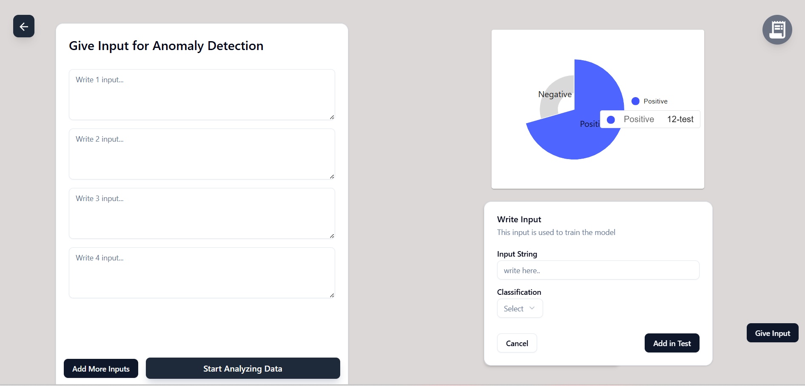
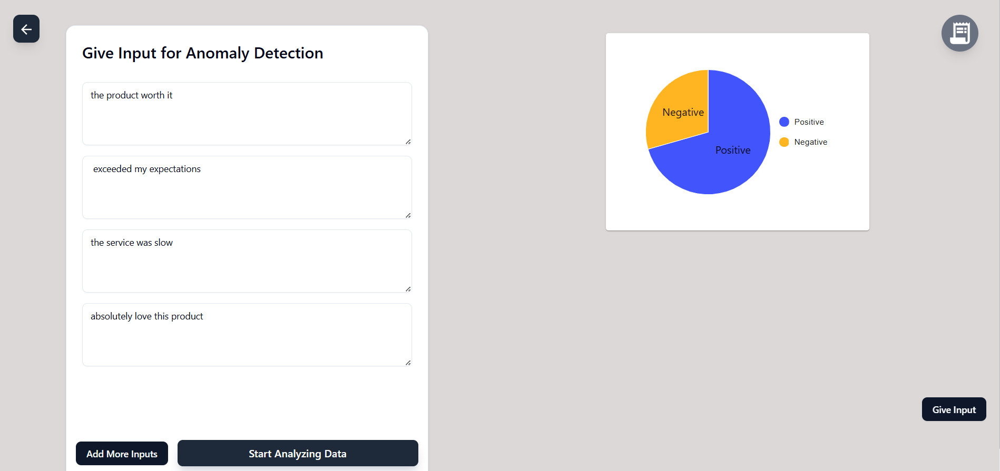
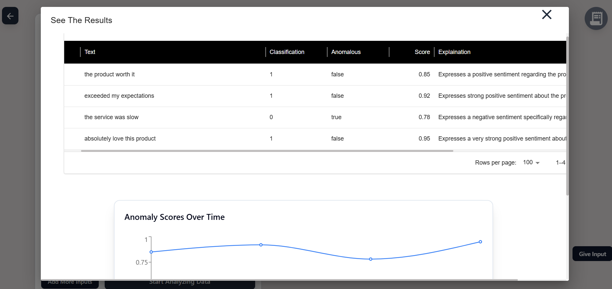
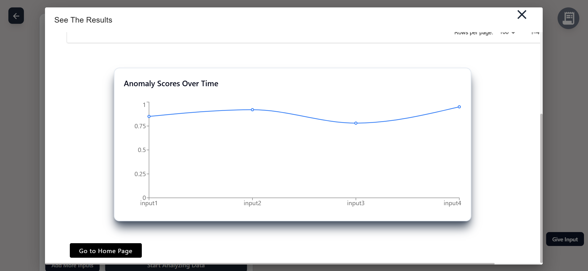

# College Anomaly Detection Frontend in React

This project is a React-based frontend application for an anomaly detection system. It allows users to input textual data, analyze anomalies, and visualize results using advanced machine learning models. The application is designed to be interactive, user-friendly, and efficient.

## Features

- **Input Management**: Users can input multiple text samples for anomaly detection.
- **Anomaly Detection**: Utilizes BERT-based deep learning models for accurate text classification and anomaly detection.
- **Visualization**: Displays results using interactive charts and graphs.
- **File Upload**: Supports uploading files for batch anomaly detection.
- **Custom Test Cases**: Allows users to create and manage test cases for analysis.
- **Real-Time Feedback**: Provides instant feedback and results for user inputs.

## Screen View

# ScreenShot 1

# ScreenShot 2

# ScreenShot 3

# ScreenShot 4

## Technology Stack

### Frontend
- **React**: For building the user interface.
- **TypeScript**: For type-safe development.
- **TailwindCSS**: For styling and responsive design.
- **Material-UI**: For pre-built UI components.

### Backend (Not included in this repository)
- **Node.js**: For API handling.
- **Generative AI MODEL**: For anomaly detection.

### State Management
- **Redux**: For managing application state.

### Visualization
- **Recharts**: For creating dynamic and interactive charts.

Future Enhancements
Add support for multilingual text analysis.
Expand visualization options for deeper insights.
Enable exporting analysis results in various formats (e.g., CSV, PDF).
Integrate additional machine learning models for improved accuracy.

